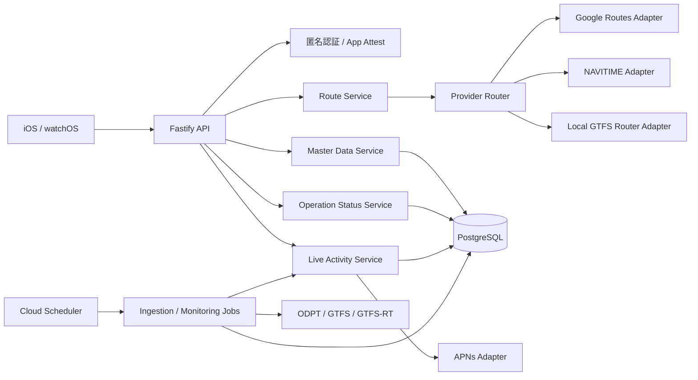
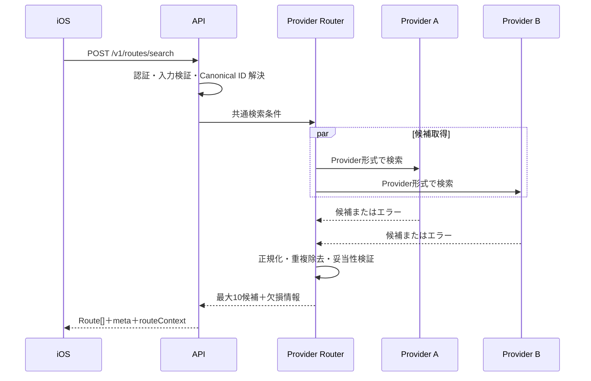
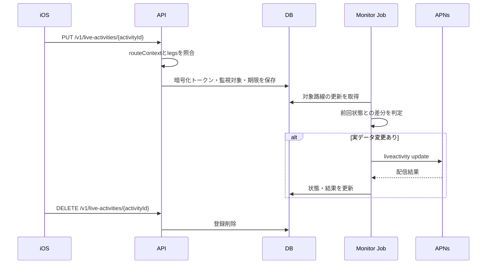

# バックエンド構成設計

| 項目 | 内容 |
| --- | --- |
| 版 | v0.1（レビュー案） |
| 作成日 | 2026-09-26 |
| 実装言語 | TypeScript |
| API | Fastify |
| DB | PostgreSQL |

## 1. 設計目標

- 外部 Provider を交換・併用できる。
- Provider ごとの ID、項目、エラーをクライアントへ漏らさない。
- 実データがない場合に推測値を作らない。
- 月額 5,000 円を初期目安とし、無料枠超過時には安全に縮退する。
- 検索履歴、位置情報など不要な個人データを保持しない。
- Live Activity の監視と通常 API を疎結合にする。

## 2. 論理構成

## 3. コンポーネント

| コンポーネント | 責務 |
| --- | --- |
| API | HTTP、入力検証、認証、レート制限、OpenAPI |
| Route Service | 共通検索条件、候補統合、重複除去、最低乗換時間検証 |
| Provider Router | 地域・条件・クォータ・障害状況から Provider を選択 |
| Provider Adapter | 外部形式と内部 Canonical Model の相互変換 |
| Master Data Service | Canonical ID、駅・路線・事業者、差分配信 |
| Operation Status Service | 運行情報の正規化、鮮度、対応状況 |
| Live Activity Service | 登録、監視、差分検出、APNs 更新、期限切れ削除 |
| Ingestion Jobs | GTFS / GTFS-RT 取得、検証、ステージング、公開 |
| Observability | 構造化ログ、メトリクス、アラート、監査 |

## 4. Provider 選択

初期ルールは次の順序とする。

1. 対象地域と条件を自前 GTFS ルーターが完全に扱える場合は自前候補を優先する。
2. 不足候補を Google Routes または NAVITIME で補う。
3. Provider のクォータ、障害、ライセンス条件を評価する。
4. 候補を Canonical Model へ変換し、重複を除去する。
5. 有効な候補が一部だけなら `partialResult: true` で返す。
6. すべて失敗した場合のみ共通エラーを返す。

無料枠が近づいた場合は、別 Provider、自前対応地域、明示エラーの順で縮退する。古い経路を最新結果に見せかけない。

## 5. データモデル

### 5.1 マスタ

- `operators`
- `lines`
- `stations`
- `station_groups`
- `station_aliases`
- `station_provider_mappings`
- `line_provider_mappings`
- `train_types`
- `master_versions`
- `master_changes`

Canonical ID はアプリ側の保存データに使われるため、Provider ID をそのまま採用しない。統合・廃止後も旧 ID から移行先を解決できるようにする。

### 5.2 交通データ

- `service_calendars`
- `trips`
- `stop_times`
- `transfers`
- `fare_rules`
- `operation_statuses`
- `data_feed_states`
- `line_capabilities`

GTFS 取込時はステージング領域で参照整合性、時刻、運行日、座標を検証し、成功した版だけを公開する。失敗時は直前の正常版を保持する。

### 5.3 Live Activity

- `installations`
- `live_activity_sessions`
- `live_activity_legs`
- `push_delivery_attempts`

Push トークンは暗号化して保存し、ログには出さない。終了後はセッションと経路を速やかに削除し、異常終了でも 24 時間以内に失効させる。配信結果はトークンを含まない統計だけ残す。

## 6. 主要フロー

### 6.1 経路検索

### 6.2 Live Activity

## 7. バックグラウンドジョブ

| ジョブ | 起動 | 内容 |
| --- | --- | --- |
| 静的フィード確認 | 毎日 | ETag / 更新日時確認、取込、検証 |
| 運行情報取得 | 通常60秒 | 障害発生中は許容範囲で30秒 |
| Live Activity評価 | データ更新時 | 関連セッションだけ差分評価 |
| マスタ差分生成 | 月次＋臨時 | バージョン、追加、更新、統合、削除 |
| 期限切れ清掃 | 定期 | セッション、トークン、古いジョブ履歴を削除 |

Cloud Scheduler から認証付きの内部 Cloud Run Job / Endpoint を起動する。API インスタンス内の常駐タイマーには依存しない。

## 8. キャッシュ

- 初期段階では Redis を導入せず、PostgreSQL とプロセス内の短寿命キャッシュを使用する。
- Provider の規約で保存が許可されたデータだけをキャッシュする。
- キャッシュキーには検索条件、Provider、データ版を含める。
- 鮮度を過ぎた結果を返す場合は `isStale: true` と `asOf` を必須とする。
- 運行情報は「情報なし」と「平常」を別状態にする。

## 9. セキュリティとプライバシー

- API キー、APNs `.p8`、DB 資格情報は Secret Manager 相当で管理する。
- 開発、ステージング、本番で秘密情報と APNs 環境を分離する。
- SQL は ORM / パラメータ化クエリを使用し、入力は JSON Schema で検証する。
- 端末・IPのレート制限、Providerごとのクォータ制限、最大検索範囲を設ける。
- 位置情報、検索履歴、お気に入りは保存しない。
- 通常ログには駅 ID、時刻、Provider、処理時間、エラー分類だけを最大30日保持する。
- Push トークン、Bearer トークン、完全な経路、外部 API の生レスポンスをログへ出さない。

## 10. 可観測性

最低限、次を計測する。

- API ごとの件数、成功率、p50 / p95 / p99 応答時間
- Provider ごとの成功率、応答時間、タイムアウト、クォータ残量
- フィードの最終成功取得時刻と公開版
- 路線ごとの運行情報の鮮度
- Live Activity の登録数、差分検出数、APNs 成功・失敗分類
- DB 接続数、ジョブ滞留数、エラー率

個人開発の初期段階では高可用性構成より、障害検知、直前正常データへの復帰、明示的な縮退を優先する。

## 11. テスト

| 種別 | 対象 |
| --- | --- |
| Unit | Canonical変換、時刻・運行日、運賃、重複除去、可用性判定 |
| Contract | OpenAPIと実装、フロント用fixture、エラー形式 |
| Adapter | 保存済みProvider fixtureからの変換。外部APIを毎回呼ばない |
| Integration | PostgreSQL、マイグレーション、検索、Live Activity登録 |
| End-to-end | 認証→検索→案内登録→疑似フィード更新→APNs Adapter |
| Data quality | GTFS参照整合性、異常時刻、座標、重複ID、急激な件数減少 |

フロントの10種類のモック要件を、バックエンドの契約fixtureとしても共有する。

## 12. 想定する実装成果物

本設計が承認された後の別セッションで、次を対象とする。

- Fastify API と OpenAPI
- PostgreSQL マイグレーション
- Provider Adapter とモック
- GTFS / GTFS-RT 取込ジョブ
- Live Activity 登録・APNs Adapter
- `/v1/capabilities` と出典表示
- Docker 開発環境
- Unit / Contract / Integration / E2E テスト
- セットアップ、Secret、運用手順

