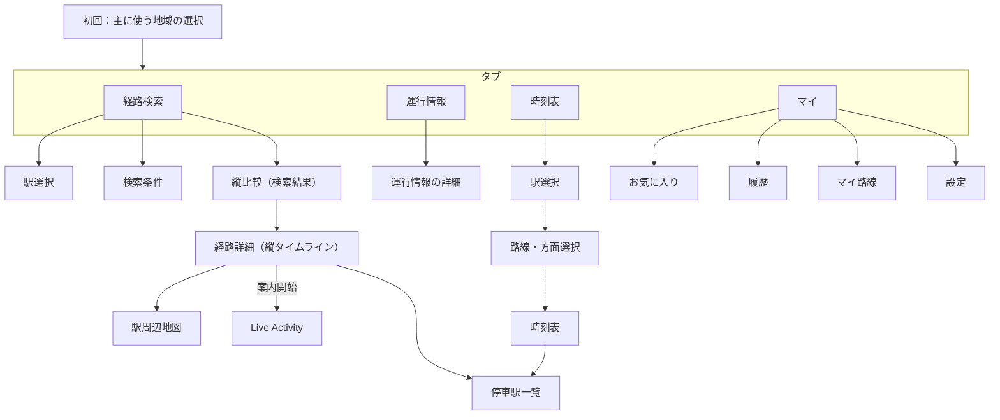
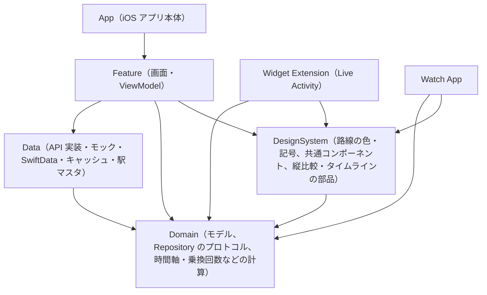

# フロントエンド要件定義書（iOS）

| 項目 | 内容 |
| --- | --- |
| 対象 | 乗り換え案内アプリ（仮称：Norikae）のフロントエンド（iOS / watchOS） |
| 版 | v1.1（修正案：バックエンド提案への回答を反映） |
| 作成日 | 2026-09-26 |
| 関連文書 | [api-contract.md](./api-contract.md)（フロントエンドが要求するデータ・API 要件）、[design-spec.md](../design/design-spec.md)（デザイン仕様）、[バックエンド設計文書](../design/README.md) |

### 改訂履歴

| 版 | 日付 | 内容 |
| --- | --- | --- |
| v1.0 | 2026-09-26 | 初版 |
| v1.1（案） | 2026-09-26 | バックエンド設計 v0.1 を受けた修正案。実データの対応範囲（1.4）、提供状況の表示（5.9）、運賃の表示ルール、1 本前・1 本後の意味、Live Activity の構成変更とオフライン時の扱い、`routeContext` の期限切れへの対応を反映。バックエンドとの合意後に「案」を外す |

---

## 1. 概要

### 1.1 目的

自分自身および身近な人が日常的に使う乗り換え案内アプリを作る。
最大の差別化要素は次の 2 点。

1. **Live Activity / Dynamic Island による移動中の現在状況の可視化**
2. **時間軸を揃えた経路の縦比較**（JR 東日本アプリ風）。出発・到着時刻と乗換回数が一目で分かること

### 1.2 対象範囲

| 区分 | 内容 |
| --- | --- |
| 対象エリア | 首都圏、関西圏（必須） |
| 対象言語 | 日本語のみ（ただし多言語化可能な構造にする） |
| 対象端末 | iPhone（縦向き固定）、Apple Watch |
| 配布 | TestFlight |

### 1.3 スコープ外

- バックエンド（経路探索エンジン、データ取得、プッシュ送信）。フロントは [api-contract.md](./api-contract.md) で要求データを定義し、モックで開発する
- Android、iPad 専用レイアウト、横向き表示
- 定期代計算

### 1.4 実データの対応範囲（初期）

バックエンドは複数の提供元を併用し、取得できない情報は推測せずに「非対応」「不明」として返す（[データ提供元・運用設計](../design/data-provider-operations.md)）。初期段階では、MVP の機能でも路線によって実データがないものがある。

| 機能 | 東京メトロ・都営地下鉄 | 首都圏のその他の路線・関西圏 |
| --- | --- | --- |
| 経路検索 | 対応 | 対応（外部 API） |
| 経由駅の指定、始発・終電の検索 | 対応（予定） | 非対応の場合あり |
| 時刻表、停車駅一覧 | 対応（予定） | 当初は非対応 |
| 運行情報 | フィード次第 | 当初は非対応（「情報なし」） |
| 番線、乗車位置 | フィード次第 | 当初は非対応 |
| 遅延による Live Activity の更新 | リアルタイム情報がある路線のみ | 当初は非対応（時刻表どおりの表示のみ） |
| IC / 切符運賃の区別 | フィード次第 | 概算運賃のみの場合あり |

- 実際の対応範囲は `GET /v1/capabilities`（[api-contract.md](./api-contract.md) 3.15）で路線・地域ごとに判定し、画面に反映する（5.9 参照）。
- MVP の完了条件は「上の範囲で対応している機能が動き、非対応の機能が非対応と分かる形で表示されること」とする。非対応の路線で機能が使えないことは MVP の不具合としない。

---

## 2. 前提・技術制約

| 項目 | 決定事項 |
| --- | --- |
| 最低 OS | iOS 18 以上 / watchOS 11 以上 |
| UI | SwiftUI（フルネイティブ） |
| 言語・ツール | 最新安定版 Xcode、Swift 6 言語モード（Strict Concurrency） |
| 文言管理 | String Catalog（`.xcstrings`）。中身は日本語のみ |
| 外部ライブラリ | 最小限。テスト用途（スナップショットテストなど）に限る |
| 永続化 | SwiftData ＋ CloudKit 同期 |
| 地図・徒歩経路 | MapKit |
| Live Activity | ActivityKit ＋ Widget Extension（SwiftUI） |
| 計測 | 導入しない（Xcode Organizer のクラッシュログのみ） |

---

## 3. 用語

| 用語 | 意味 |
| --- | --- |
| 経路（Route） | 出発地から到着地までの 1 つの移動案。複数の区間で構成される |
| 区間（Leg） | 1 本の列車に乗車する区間、または徒歩での乗換 |
| 縦比較 | 複数の経路を、共通の時間軸で縦方向に並べて比較する画面 |
| 縦タイムライン | 1 経路の詳細を、駅と路線を縦の線で表した表示 |
| 案内 | ユーザーが選んだ経路で Live Activity を起動し、移動を追跡している状態 |
| マイ路線 | ユーザーが登録した、運行状況を優先表示する路線 |
| 路線記号 | JY、G、M などの路線を表す英字記号 |

---

## 4. 画面構成

### 4.1 タブ構成

| タブ | 役割 |
| --- | --- |
| 経路検索 | 駅入力 → 検索条件 → 縦比較 → 経路詳細 → 案内開始 |
| 運行情報 | マイ路線と、エリア・会社別の路線の運行状況 |
| 時刻表 | 駅 → 路線 → 方面の時刻表 |
| マイ | お気に入り、履歴、マイ路線、設定 |

### 4.2 画面遷移

---

## 5. 機能要件

要件 ID の優先度は **MVP**（初回リリースに必須）または **MVP後半**（MVP の範囲内で後から着手）とする。次フェーズ以降の項目は「13. フェーズ計画」を参照。

### 5.1 初回起動（オンボーディング）

| ID | 要件 | 優先度 |
| --- | --- | --- |
| FR-ONB-01 | 初回起動時に、主に使う地域（首都圏 / 関西圏）を選ばせる。駅候補の並び順と運行情報の初期表示に使う | MVP |
| FR-ONB-02 | 機能紹介は表示しない（または省略できる） | MVP |
| FR-ONB-03 | 初回起動時には権限を要求しない。権限はその機能を初めて使うときに要求する | MVP |
| FR-ONB-04 | 主に使う地域は、設定から後で変更できる | MVP |

### 5.2 経路検索：駅入力

| ID | 要件 | 優先度 |
| --- | --- | --- |
| FR-SRC-01 | 出発駅と到着駅を入力できる | MVP |
| FR-SRC-02 | 駅名の候補は、アプリに同梱した駅マスタを使い、端末内で検索する（オフラインでも動く） | MVP |
| FR-SRC-03 | 漢字表記と読み（ひらがな）の両方で、前方一致・部分一致の検索ができる | MVP |
| FR-SRC-04 | 同じ名前の駅は、都道府県名と路線名を併記して区別する。並び順は、主に使う地域の駅を優先する | MVP |
| FR-SRC-05 | 現在地から最寄り駅を候補に出す（位置情報は「使用中のみ」） | MVP |
| FR-SRC-06 | 入力欄の下に、履歴とお気に入りから候補を出す | MVP |
| FR-SRC-07 | 出発駅と到着駅を入れ替えるボタンを置く | MVP |
| FR-SRC-08 | 駅マスタは API から差分を取得して更新する（[api-contract.md](./api-contract.md) 参照）。同梱する駅マスタは、バックエンドの月次スナップショットから作る | MVP |
| FR-SRC-09 | 駅マスタの差分で駅が統合・廃止された場合（`replacedById`）、保存済みのお気に入り・履歴・マイ路線の ID を移行先に置き換える。移行先がない場合は、その項目に「この駅は利用できません」と表示する | MVP |

### 5.3 経路検索：検索条件

| ID | 要件 | 優先度 |
| --- | --- | --- |
| FR-CND-01 | 日時の指定：出発 / 到着 / 始発 / 終電。始発・終電は、提供状況（`firstLastTrain`）が非対応の地域では選べないことを示す | MVP |
| FR-CND-02 | 経由駅を最大 3 つ指定できる。提供状況（`viaStations`）が非対応の地域では選べないことを示し、検索時に `FEATURE_UNAVAILABLE` が返った場合は経由駅を外して再検索する導線を出す | MVP |
| FR-CND-03 | 新幹線と有料特急を、それぞれ使うか使わないか切り替えられる | MVP |
| FR-CND-04 | 並び替え：早い順 / 乗換回数が少ない順 / 安い順。並び替えはアプリ内で行う（サーバーの返す順番は保証されない） | MVP |
| FR-CND-05 | 運賃を IC カード運賃で出すか、切符運賃で出すかを切り替えられる。設定した種別の運賃がない場合の表示は [api-contract.md](./api-contract.md) 3.8 の表示ルールに従う | MVP |
| FR-CND-06 | 各条件の初期値は、マイ画面の設定に従う | MVP |

### 5.4 縦比較（検索結果）

| ID | 要件 | 優先度 |
| --- | --- | --- |
| FR-CMP-01 | 検索結果の複数の経路を、横に並べた列として表示する | MVP |
| FR-CMP-02 | 3 列を画面内に固定表示し、4 本目以降は横スクロールで表示する | MVP |
| FR-CMP-03 | 全ての列で縦の時間軸を共通にする。軸の範囲は、全経路の中で一番早い出発から一番遅い到着まで。1 分あたりの高さは画面の高さに合わせて自動で決める | MVP |
| FR-CMP-04 | 各列の上部に、出発→到着時刻、所要時間、乗換回数、運賃をまとめて表示する。運賃は概算なら「約◯円」、不明なら「運賃不明」と表示する | MVP |
| FR-CMP-05 | 乗車区間は、路線の色の帯と路線記号で表示する。路線記号がない路線は略称または路線名、路線色がない路線は既定色で表示する | MVP |
| FR-CMP-06 | 乗換での待ち時間や徒歩は、点線で表示する | MVP |
| FR-CMP-07 | 「早」（所要時間が最短）「楽」（乗換回数が最少）「安」（運賃が最安）のバッジを付ける。1 つの経路に複数付いてもよい。「安」は、全経路の表示運賃が同じ種別のときだけ付ける（種別の混在や運賃不明があれば付けない） | MVP |
| FR-CMP-08 | 遅延・運転見合わせの影響がある路線を含む経路には、警告バッジを付ける | MVP |
| FR-CMP-09 | 列をタップすると経路詳細に移る | MVP |
| FR-CMP-10 | 日付をまたぐ経路（終電など）でも、時間軸が正しく連続する | MVP |
| FR-CMP-11 | 読み込み中は、縦比較の骨組みをスケルトン表示する | MVP |
| FR-CMP-12 | 応答が `partialResult: true` のときは「一部の情報を取得できませんでした」、`isStale: true` のときは取得時刻を、縦比較の上部に表示する | MVP |
| FR-CMP-13 | 応答の出典（`attributions`）を画面下部に表示する | MVP |

### 5.5 経路詳細（縦タイムライン）

| ID | 要件 | 優先度 |
| --- | --- | --- |
| FR-DTL-01 | 経路を縦のタイムラインで表示する：駅、発着時刻、路線（色と記号）、種別、行き先、番線、乗換時間。番線がない区間は番線欄を出さない | MVP |
| FR-DTL-02 | 「この経路で案内開始」ボタンで Live Activity を開始する（6 章参照）。`routeContext` の期限が切れている場合は、同じ検索条件で再検索してから開始する（[api-contract.md](./api-contract.md) 4.2） | MVP |
| FR-DTL-03 | 経路をお気に入りに登録できる。お気に入りには検索条件と経路の特定情報（区間の路線・乗車駅・降車駅・出発時刻）を保存し、開くときに再検索する | MVP |
| FR-DTL-04 | 経路を共有できる（テキスト、スクリーンショット） | MVP |
| FR-DTL-05 | 乗車位置（例：「3号車が乗換に便利」）を表示する。データがない区間では表示しない | MVP |
| FR-DTL-06 | 1 本前・1 本後の経路に切り替えられる。経路全体を探し直すため、乗換駅・乗換後の列車・到着時刻が変わることがある。変わった場合は、その旨を表示する | MVP |
| FR-DTL-07 | 区間をタップすると、その列車の停車駅一覧を表示する（時刻表の停車駅一覧と同じ画面を使う）。`trainRunId` がない区間はタップできないようにし、見た目でも区別する | MVP |
| FR-DTL-08 | 駅周辺の地図を表示できる（駅の出口、駅まで歩く経路） | MVP |
| FR-DTL-09 | 遅延の影響がある区間には、遅延情報を表示する | MVP |
| FR-DTL-10 | 経路の `warnings` を表示する（区間に関するものはその区間の近くに出す） | MVP |
| FR-DTL-11 | 見込み時刻がない区間を「定刻」と表示しない。リアルタイム情報に対応していない区間には「時刻表上の時刻」であることを示す | MVP |
| FR-DTL-12 | 応答の出典（`attributions`）を画面下部に表示する | MVP |

### 5.6 運行情報

| ID | 要件 | 優先度 |
| --- | --- | --- |
| FR-STS-01 | 一番上に、マイ路線の運行状況を表示する | MVP |
| FR-STS-02 | 首都圏 / 関西圏を切り替え、鉄道会社ごとに路線の一覧を表示する。初期表示は主に使う地域 | MVP |
| FR-STS-03 | 状態（平常 / 遅延 / 運転見合わせ / 情報なし など）は、アイコン・色・文字の 3 つで表示する。「情報なし」（`unknown`）は「平常」と明確に区別する | MVP |
| FR-STS-04 | 詳細画面に、原因、発生時刻、見込み、振替輸送の有無を表示する | MVP |
| FR-STS-05 | 情報の取得時刻を表示する | MVP |
| FR-STS-06 | 運行情報に対応していない路線（提供状況 `operationAlerts` が `unavailable`）は、一覧の中で「運行情報非対応」とまとめて表示する。マイ路線に登録した場合も同様に表示する | MVP |
| FR-STS-07 | 応答の出典（`attributions`）を画面下部に表示する | MVP |

### 5.7 時刻表

| ID | 要件 | 優先度 |
| --- | --- | --- |
| FR-TT-01 | 駅 → 路線 → 方面の順に選んで時刻表を表示する。時刻表に対応していない路線（提供状況 `timetable` が `unavailable`）は、選べない状態で「時刻表非対応」と表示する | MVP |
| FR-TT-02 | 平日 / 土曜 / 休日を切り替えられる。初期表示は今日の曜日区分 | MVP |
| FR-TT-03 | 種別（快速など）と行き先を、色または略称で表示する | MVP |
| FR-TT-04 | 当駅始発の列車に印を付ける | MVP |
| FR-TT-05 | 表示したときに、今の時刻の位置まで自動でスクロールする | MVP |
| FR-TT-06 | 列車をタップすると停車駅一覧を表示する | MVP |
| FR-TT-07 | 時刻表をお気に入りに登録し、すぐに開けるようにする | MVP |
| FR-TT-08 | 応答の出典（`attributions`）を画面下部に表示する | MVP |

### 5.8 マイ

| ID | 要件 | 優先度 |
| --- | --- | --- |
| FR-MY-01 | お気に入り（経路・駅・時刻表）の一覧、並べ替え、削除 | MVP |
| FR-MY-02 | 検索履歴の一覧と削除（1 件ずつ・全件） | MVP |
| FR-MY-03 | マイ路線の登録と削除 | MVP |
| FR-MY-04 | 検索条件の初期値の設定（IC/切符、新幹線・有料特急を使うか、並び替え） | MVP |
| FR-MY-05 | リマインドの設定（余裕の時間：0 / 3 / 5 分、歩く速さ） | MVP |
| FR-MY-06 | iCloud 同期のオン・オフ | MVP |
| FR-MY-07 | 主に使う地域の変更 | MVP |
| FR-MY-08 | データの提供元（出典）とライセンスの表示。`GET /v1/attributions` の全件を表示し、取得できない場合は直前のキャッシュを表示する | MVP |

### 5.9 提供状況（capabilities）

| ID | 要件 | 優先度 |
| --- | --- | --- |
| FR-CAP-01 | 起動時と 1 日 1 回、`GET /v1/capabilities` で路線・地域ごとの提供状況を取得し、端末にキャッシュする | MVP |
| FR-CAP-02 | 非対応の機能は、ボタンを隠さずに「非対応」と分かる状態（選べない状態と説明文）で表示する。対象：経由駅、始発・終電、時刻表、停車駅一覧、運行情報、乗車位置、Live Activity の遅延更新 | MVP |
| FR-CAP-03 | 提供状況を取得できず、キャッシュもない場合は、全機能を利用可能として扱い、API のエラー（`FEATURE_UNAVAILABLE`）で判定する | MVP |
| FR-CAP-04 | 非対応の表示の文言と見た目は、画面間で共通の部品（`DesignSystem`）にそろえる | MVP |

---

## 6. Live Activity / Dynamic Island / Apple Watch

### 6.1 ライフサイクル

| ID | 要件 | 優先度 |
| --- | --- | --- |
| FR-LA-01 | 経路詳細の「この経路で案内開始」で、手動で開始する | MVP |
| FR-LA-02 | 同時に案内できる経路は 1 つだけ。新しく開始したら、前の案内は終了する | MVP |
| FR-LA-03 | 到着予定時刻を過ぎたら自動で終了する（遅延分は延長する） | MVP |
| FR-LA-04 | 「案内終了」ボタンで、手動でも終了できる | MVP |

### 6.2 表示内容

| 表示場所 | 内容 |
| --- | --- |
| ロック画面 / 展開した Dynamic Island | 次に乗る列車（路線の色・記号、種別、行き先）、番線、発車までのカウントダウン、次の乗換駅、到着予定時刻、経路全体の進み具合（プログレスバー）、遅延の分数。リアルタイム情報に対応していない区間では「時刻表どおりの表示」と示す |
| Dynamic Island（小さい表示） | 路線の色 ＋ 発車までの時間 |
| Dynamic Island（最小表示） | 路線の色 ＋ 残り時間 |
| Apple Watch（スマートスタック） | 次の列車・番線・発車までの時間（Watch 向けの小さい表示を調整する） |

### 6.3 更新方法

| ID | 要件 | 優先度 |
| --- | --- | --- |
| FR-LA-10 | 基本は端末だけで動かす。時刻表どおりに `Text(timerInterval:)` などで自動カウントダウンし、区間の進行は予定時刻で切り替える | MVP |
| FR-LA-11 | 開始時に ActivityKit のプッシュトークンを取得し、バックエンドに登録する。トークンが更新されたら同じ `activityId` で登録し直す。終了時には登録を解除する | MVP |
| FR-LA-12 | 遅延・運休・番線の変更があったときは、プッシュで表示を上書きする（送信はバックエンドの担当。データの形は [api-contract.md](./api-contract.md) 5.3 参照）。リアルタイム情報に対応していない区間にはプッシュが届かないため、「遅延なし」と見せない | MVP |
| FR-LA-13 | オフラインでも、時刻表どおりのカウントダウンを続ける | MVP |
| FR-LA-14 | 登録（API-09）に失敗しても Live Activity は開始し、時刻表どおりの表示で動かす。通信が戻ったら登録を再試行する | MVP |

### 6.4 ボタン操作（インタラクティブ）

| ID | 要件 | 優先度 |
| --- | --- | --- |
| FR-LA-20 | 「1本後に変更」ボタン：API-02 で直後の経路を取得し、表示を更新する（`LiveActivityIntent` で実装）。経路の構成（乗車区間の路線・乗車駅・降車駅）が同じなら `ContentState` を更新し、構成が変わる場合は現在の Live Activity を終了して新しい経路で開始し直す（[api-contract.md](./api-contract.md) 5.3） | MVP |
| FR-LA-21 | オフラインで「1本後に変更」を押した場合は、経路を変更せず、「オフラインのため変更できません」と表示する（経路全体を端末だけで探し直せないため、推測した経路は出さない） | MVP |
| FR-LA-22 | 「案内終了」ボタン | MVP |

### 6.5 Apple Watch

| ID | 要件 | 優先度 |
| --- | --- | --- |
| FR-WCH-01 | iPhone の Live Activity をスマートスタックに自動表示する（watchOS 標準機能）。Watch 向けの表示を最適化する | MVP |
| FR-WCH-02 | 簡単な Watch アプリ：お気に入り経路の次の発車時刻、案内中の経路のタイムライン | MVP後半 |

---

## 7. 通知・位置情報・権限

### 7.1 出発リマインド

| ID | 要件 | 優先度 |
| --- | --- | --- |
| FR-NTF-01 | 通知は出発リマインド（ローカル通知）のみ。遅延のプッシュ通知は行わない | MVP |
| FR-NTF-02 | 対象は、案内を開始した経路のみ | MVP |
| FR-NTF-03 | 案内開始時に、現在地から出発駅まで歩く時間を MapKit の徒歩経路で求め、「発車時刻 − 歩く時間 − 余裕の時間」にローカル通知を予約する | MVP |
| FR-NTF-04 | アプリまたは Live Activity を開くたびに現在地を取り直し、通知の時刻を再計算して予約し直す | MVP |
| FR-NTF-05 | 位置情報が取れない場合は、「発車時刻 − 余裕の時間」で予約する | MVP |
| FR-NTF-06 | 余裕の時間（0 / 3 / 5 分）と歩く速さは、マイ画面で設定できる | MVP |

### 7.2 権限

| 権限 | 要求するタイミング | 範囲 |
| --- | --- | --- |
| 位置情報 | 最寄り駅・駅周辺地図・リマインドを初めて使うとき | 使用中のみ（常に許可は求めない） |
| 通知 | 案内開始やリマインドの設定を初めて使うとき | 通常の通知 |

- 権限が拒否された場合でも、該当機能以外は通常どおり使えること。拒否された機能の画面には、設定アプリへ移る導線を表示する。

---

## 8. データ保存・同期・オフライン

### 8.1 保存するデータ

| データ | 保存先 | 同期 |
| --- | --- | --- |
| お気に入り（経路・駅・時刻表） | SwiftData | CloudKit |
| 検索履歴 | SwiftData | CloudKit |
| マイ路線 | SwiftData | CloudKit |
| 設定値 | SwiftData または UserDefaults | 同期する項目は CloudKit |
| 駅マスタ | アプリに同梱し、差分を API で更新 | なし |
| 検索結果・時刻表のキャッシュ | 端末内のみ | なし |
| 案内中の経路 | App Group の共有領域（アプリと Widget Extension で共有） | なし |
| 提供状況（capabilities）・出典 | 端末内のキャッシュ | なし |
| 認証トークン | Keychain | なし |

- お気に入り経路と検索結果のキャッシュには、短寿命の `routeContext` ではなく検索条件を保存する（[api-contract.md](./api-contract.md) 4.2）。
- 検索履歴、お気に入り、位置情報はサーバーに保存されない（バックエンド側の方針とも一致）。

### 8.2 オフライン・通信エラー

| ID | 要件 | 優先度 |
| --- | --- | --- |
| FR-OFF-01 | 直近の検索結果（20 件程度）と、閲覧した時刻表をキャッシュする | MVP |
| FR-OFF-02 | キャッシュを表示するときは、「◯時◯分時点の情報」と取得時刻を明示する | MVP |
| FR-OFF-03 | お気に入りと履歴はオフラインでも見られる | MVP |
| FR-OFF-04 | 駅名の候補はオフラインでも出る（同梱の駅マスタを使う） | MVP |
| FR-OFF-05 | Live Activity はオフラインでも時刻表どおりに動き続ける | MVP |
| FR-OFF-06 | キャッシュした検索結果から、案内開始・1 本前・1 本後を操作した場合は、保存した検索条件で再検索してから実行する。オフラインの場合は「オフラインのため実行できません」と表示する | MVP |

---

## 9. アーキテクチャ

### 9.1 方針

- `@Observable` を使った MVVM
- Swift Package でモジュールに分割し、Widget Extension・Watch とモデルやデザイン部品を共有する
- データの取得は Repository のプロトコルで抽象化し、本物の API 実装とモックを差し替えられるようにする

### 9.2 モジュール構成

| モジュール | 責務 |
| --- | --- |
| `Domain` | 経路・駅・路線などのモデル、Repository のプロトコル、時間軸の計算や「早・楽・安」判定などの純粋なロジック。他のモジュールに依存しない |
| `Data` | Repository の実装（API クライアント、モック）、認証（匿名インストール登録・トークン更新）、SwiftData、キャッシュ、駅マスタの検索 |
| `DesignSystem` | 路線の色・記号の表示（記号・色がない路線の代替表示を含む）、非対応・情報なしの表示部品、共通コンポーネント、縦比較とタイムラインの描画部品 |
| `Feature` | 画面ごとの View と ViewModel |

- アプリと Widget Extension は App Group を通して、案内中の経路を共有する。
- API の呼び出しはアプリ本体のプロセスで行う。`LiveActivityIntent`（「1本後に変更」）はアプリ本体のプロセスで実行されるため、Widget Extension に認証トークンを渡す必要はない。
- `ActivityAttributes.ContentState` は `Domain` に置き、日時は UNIX 時刻の `Int` で持つ（[api-contract.md](./api-contract.md) 5.3）。

---

## 10. UI / UX 共通方針

### 10.1 デザイン

- Apple の Human Interface Guidelines をベースに、標準コンポーネントを使う
- 縦比較と縦タイムラインは独自デザインにする
- 路線の色をアクセントとして使う

### 10.2 アクセシビリティ

| ID | 要件 | 優先度 |
| --- | --- | --- |
| NFR-A11Y-01 | ダークモードに対応する | MVP |
| NFR-A11Y-02 | Dynamic Type に対応する（縦比較・タイムラインを含む） | MVP |
| NFR-A11Y-03 | VoiceOver に対応する。縦比較の各列は、出発・到着・所要時間・乗換回数・運賃を読み上げる | MVP |
| NFR-A11Y-04 | 路線は色だけで区別せず、必ず路線記号を併記する。公式の路線記号がない路線は、略称（`displayCode`）または路線名を併記する | MVP |
| NFR-A11Y-05 | 運行状況は、アイコン・色・文字の 3 つで表す（「情報なし」を含む） | MVP |

### 10.3 状態の見せ方

| 状態 | 方針 |
| --- | --- |
| 読み込み中 | スケルトン表示（縦比較は骨組みを先に出す）。スピナーは使わない |
| 空の状態 | 案内文と、行動を促すボタンを表示する（例：履歴がないとき「駅を検索する」） |
| エラー | アラートは使わず、画面内に表示して再試行ボタンを置く。再試行ボタンは `retryable: true` のときだけ出す。エラーコードごとの扱いは [api-contract.md](./api-contract.md) 2.3 |
| キャッシュ表示 | 取得時刻を明示する（エラー表示と見た目をそろえる）。`isStale: true` の応答も同じ見た目にする |
| 一部欠損 | `partialResult: true` のとき、「一部の情報を取得できませんでした」を画面内に表示する |
| 非対応 | 提供状況で非対応の機能は、隠さずに選べない状態と説明文で表示する（5.9） |
| 情報なし | 取得できない情報を、「平常」「定刻」「遅延なし」などに読み替えて表示しない |

### 10.4 端末・向き

- iPhone のみ、縦向き固定

---

## 11. 非機能要件

| ID | 要件 |
| --- | --- |
| NFR-01 | Swift 6 言語モード（Strict Concurrency）でビルドが通ること |
| NFR-02 | 文言は String Catalog で管理し、コードに直接書かないこと |
| NFR-03 | 位置情報はサーバーに送らないこと（最寄り駅の検索は端末内の駅マスタで行う。徒歩経路は MapKit を使う） |
| NFR-04 | Privacy Manifest を用意すること |
| NFR-05 | 外部ライブラリはテスト用途に限ること |

※ 性能目標（起動時間、検索結果の表示時間など）は未定。14 章「未決事項」を参照。

---

## 12. テスト・CI・配布

### 12.1 テスト

| 種類 | 対象 | 必須 |
| --- | --- | --- |
| ユニットテスト（Swift Testing） | `Domain`（時間軸の計算、日付をまたぐ時刻、乗換回数、「早・楽・安」判定、運賃の表示と「安」の判定条件、路線記号の代替表示、`routeContext` 期限切れ時の同一経路の照合、1 本後の経路の構成変更の判定、リマインド時刻の計算）、ViewModel | 必須 |
| スナップショットテスト | 縦比較、縦タイムライン、Live Activity（ロック画面・Dynamic Island の各サイズ、リアルタイム非対応の区間を含む）、非対応・情報なしの表示。ライト・ダーク、Dynamic Type の主要サイズ | 必須 |
| UI テスト | 主要な流れ 1 本：検索 → 縦比較 → 経路詳細 → 案内開始 | 必須 |
| 契約テスト | [api-contract.md](./api-contract.md) 7 章のモック場面を、バックエンドと共有する fixture（OpenAPI が正本）でデコードできること。`ContentState` の JSON 例のデコード | 必須 |

- テストはモックの Repository で動かす。

### 12.2 CI・配布

- CI：GitHub Actions（ビルドとテスト）
- 配布：TestFlight
- Apple Developer Program への登録が必要（Live Activity のプッシュ更新、TestFlight、CloudKit のため）

---

## 13. フェーズ計画

| フェーズ | 内容 |
| --- | --- |
| MVP | 5〜8 章の「MVP」項目すべて |
| MVP後半 | 簡単な Watch アプリ（FR-WCH-02） |
| 次のフェーズ | ホーム画面・ロック画面のウィジェット、ショートカット（App Intents：「帰宅経路を検索」など）、自宅・職場の登録と、お気に入り経路の定期リマインド |
| 将来 | 線路の形の地図表示、定期代の計算、バス・飛行機、経路検索の条件としての歩く速さ、多言語化、Watch のコンプリケーション・Watch 単体での検索、経路の途中からの再検索、カレンダーへの追加 |

---

## 14. 未決事項

| # | 内容 | 決める人・タイミング |
| --- | --- | --- |
| 1 | ~~経路データの提供元~~ → Google Routes・NAVITIME・ODPT / GTFS の併用で提案済み（[データ提供元・運用設計](../design/data-provider-operations.md)）。出典の文言は未確定 | バックエンド担当 |
| 2 | ~~駅マスタの差分を更新する頻度と方式~~ → 月次＋臨時で提案済み。同梱用スナップショットの受け渡し方法は未定 | バックエンド担当と調整 |
| 3 | 性能目標（起動時間、検索結果の表示時間、縦比較のスクロール性能）。バックエンドの経路検索は通常 2 秒以内・最大 5 秒で打ち切りの提案 | 実装開始前 |
| 4 | 歩く速さの選択肢（例：ゆっくり / 普通 / 速い）と、それぞれの補正値 | 詳細設計時 |
| 5 | アプリの正式名称とアイコン | 任意 |
| 6 | 「1本後に変更」で経路の構成が変わる場合に、`LiveActivityIntent` からアプリがバックグラウンドのまま新しい Live Activity を開始できるか。できない場合は「案内終了」してアプリを開くよう促す表示にする | 実装開始前に実機で検証 |
| 7 | 「非対応」「情報なし」「時刻表どおりの表示」の文言とデザイン | 詳細設計時（design-spec に追加） |
